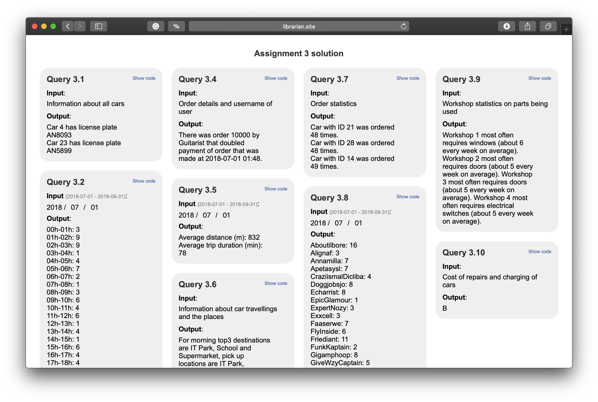
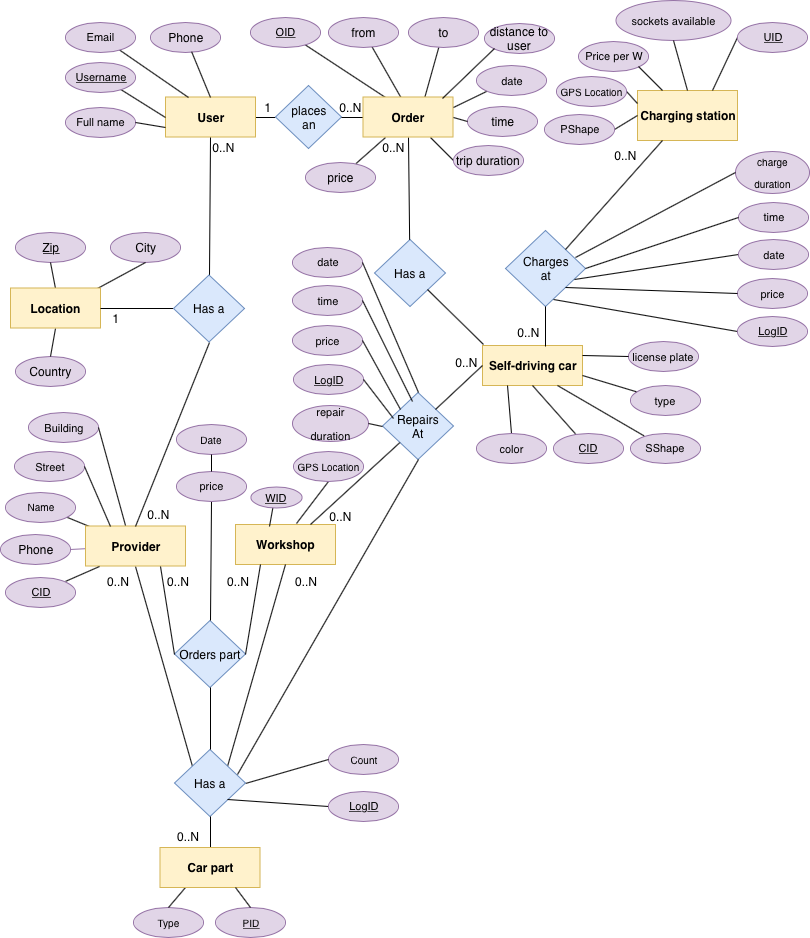
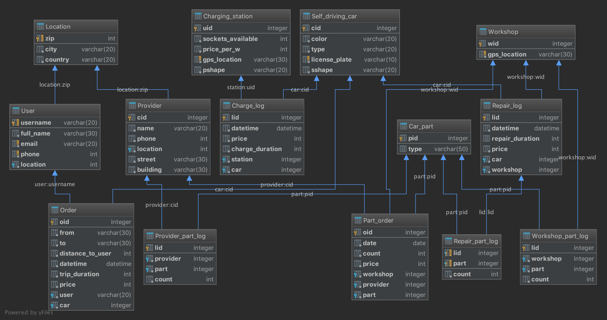

# Assignment 3

Implemented by Pavel Nikulin, Elvira Salikhova, George Poputnikov

## Content

```database/Assignment3.sqlite``` - main database 

```database/db_feed.py``` - script to create random data setup

```database/script.sql``` - delete all data from tables

```server/app.py``` - ```flask``` server for the implemented queries

```SQL/DDL.sql``` - description of database models

```SQL/3_n (n:1-10)``` - implementation of the queries

```SQL/README.md``` - project full report

```Dockerfile``` - setup script for deployment

```docs/*``` - frontend implementation as GUI for database

```docs/script.js``` - main frontend engine (pure js used)


## GUI

[](http://librarian.site)

## ERD



## Schema


